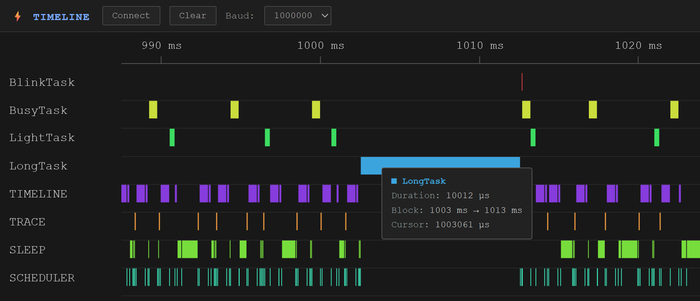

# Harmonic Scheduler

> API and behavior may change. Not recommended for critical applications yet.

 A C++11 header-only library for cooperative task scheduling on microcontrollers.

# 

```text
ID          CPU(%)  CALLS  TIME(us) MAX(us)
BUSY        23             231588   975120
IDLE        23             229184
SLEEP       52             514348
-------------------------------------------
LOG         1       3      18688    18624
BlinkTask   0       2      72       40
BusyTask    12      239    126392   584
LightTask   5       172    56284    368
LongTask    3       3      30152    10060
```


## Library
- **Header-only, Pure C++11:** All classes are in the `Harmonic` namespace and available via a single include; zero `std::` dependencies.
- **Templated Scheduler**: Schedulers can be configured with fixed number of tasks, profiler options, and idle sleep enabled/disabled at compile time.
- **Integrated Profiling System:** Configurable **`ProfilerMode`** (*Metrics* polling vs. *Timeline* streaming) and **`ProfilerLevel`** (*System* vs. *Task* granularities).
- **Template Profiling Log**: Built-in log tasks formatted for real-time console/serial metric output.
- **RTOS compatible:** Supports bare-metal, RTOS, and desktop operating-system environments.
- **Backwards compatible:** Drop-in compatibility wrappers for TaskScheduler codebases (TS::CompatibilityTask).


## Scheduler
- **Fast Cooperative Dispatch:** Optimized execution path with very low overhead when profiling is disabled.
- **Flexible task scheduling:** Dynamic enable/disable, re-arm, and manage execution delay at any time.
- **Dynamic task management:** Safely add and remove tasks at runtime (outside ISR context).
- **Low-power operation:** Platform-agnostic idle/sleep integration to minimize MCU power consumption between task passes.
- **Metrics Logging:** Tracks system-level timing metrics (busy time, scheduling, idle sleep) and task-level metrics (call counts, total duration, max duration).
- **Timeline Streaming:** Streams timestamped event markers directly to custom output handlers (e.g., Serial, ring buffer, network).


## Tasks
- **Dynamic tasks:** `DynamicTask` is the default task type for consumers. Subclass it and override `Run()` to implement task behavior.
- **Runtime scheduling control:** Dynamic tasks can attach to or detach from a `TaskRegistry`, enable or disable themselves, change their next-run delay, and request immediate execution.
- **Callable tasks:** `CallableTask` adapts either a `void()` function pointer or a `void(void*)` function pointer with context. It does not use dynamic allocation or `std::function`.
- **Periodic tasks:** `PeriodicTask` is available when a task needs period-based scheduling. Subclass it and override `PeriodicRun()`.
  - The first run can be immediate or delayed until the first period.
  - `Sync` mode maintains the periodic schedule and can preserve its original phase.
  - `Resync` mode re-anchors the schedule when execution falls more than two periods behind.
  - `SyncToNow()` explicitly resets the next due time relative to the current timestamp.
- **Interrupt-driven tasks:** Built-in tasks provide ISR-safe notification mechanisms:
  - `InterruptFlag::CallbackTask`: Coalesces pending flag interrupts and notifies a listener from the scheduler context.
  - `InterruptSignal::CallbackTask<signal_t>`: Accumulates signal interrupts and reports the pending count to a listener.
  - `InterruptEvent::CallbackTask<TimestampSource, interrupt_count_t>`: Records the first pending event timestamp and accumulates subsequent events until the task runs.
- **Custom task types:** Any class implementing `ITask` can be registered with a `TaskRegistry`. Task registration and removal are performed outside ISR context; task state changes and wake operations are designed to be safe from interrupt context.

## Quick Start

```cpp
#include <Arduino.h>
#include <HarmonicScheduler.h>

class BlinkDynamicTask final : public Harmonic::DynamicTask
{
public:
    BlinkDynamicTask(Harmonic::TaskRegistry& registry)
        : Harmonic::DynamicTask(registry) {}

    bool Setup()
    {
        pinMode(LED_BUILTIN, OUTPUT);
        return Attach(500); // 500ms interval
    }

    void Run() final
    {
        digitalWrite(LED_BUILTIN, !digitalRead(LED_BUILTIN));
    }
};

Harmonic::TemplateScheduler<1> Runner{};
BlinkDynamicTask Blink(Runner);

void setup()
{
    Blink.Setup();
}

void loop()
{
    Runner.Loop();
}
```

## Scheduling Behavior

HarmonicScheduler uses cooperative scheduling. The scheduler only evaluates tasks when its loop method is called, and each task callback runs to completion before the scheduler continues.

### Time base and jitter

- The scheduler timestamp unit is **milliseconds**, derived from `Platform::GetTimestamp()`.
- Task delays and periods are specified in **milliseconds**.
- Profiling timestamps use **microseconds**, derived from `Platform::GetProfilerTimestamp()`.
- Tasks are evaluated once per scheduler loop call. Actual callback timing is therefore affected by timestamp resolution, loop frequency, scheduler overhead, and the execution time of other tasks.
- A task may run later than its configured delay or period, but the scheduler does not intentionally run it before the required delay has elapsed.

### Base task scheduling

The default scheduler uses a simple delay-from-last-run model:

- Each registered task has an enabled state, a delay in milliseconds, and a timestamp for its last scheduled run.
- A task is eligible when it is enabled and its configured delay has elapsed.
- The scheduler records the current timestamp before invoking the task callback.
- A task callback that takes a long time, or a scheduler loop that is called late, delays other tasks.
- The base scheduler does not maintain a phase-locked periodic schedule. Repeated executions can therefore drift later over time.
- A delay of `0` makes an enabled task eligible on every scheduler pass.
- `SetDelay(delay)` changes the delay measured from the task's last scheduled run.
- `SetDelayFromNow(delay)` starts the delay from the moment it is called.
- `WakeNow()` makes the task eligible on the next scheduler pass and is suitable for waking a task from an ISR.
- Delayed scheduler passes do not cause missed executions to be replayed as a burst.

### ISR wake behavior

- `WakeFromISR()` and task-specific wake methods are intended for use from interrupt context.
- An ISR does not execute the task callback directly.
- A task woken from an ISR runs when the scheduler reaches the next eligible loop pass.
- Interrupt notification tasks collect or coalesce pending events until they are processed in the scheduler context.

### Periodic task scheduling

Use `PeriodicTask` when a task requires explicit, phase-anchored periodic behavior rather than standard relative delay-from-last-run execution.

- `Start(period, true)` enables the task for immediate first execution.
- `Start(period, false)` delays the first execution by one period.
- `OverrunMode::PhaseLock` preserves phase alignment by anchoring the next due time strictly to the fixed periodic grid ($T_0 + N \times P$), regardless of lateness or execution duration.
- `OverrunMode::Reanchor` prevents catch-up cascades by re-anchoring the periodic phase relative to the last execution start ($T_{\text{start}} + P$) whenever lateness occurs.
- `SyncToNow()` resets the underlying periodic grid relative to the current timestamp.

<pre>
Overrun Behavior Scenarios
 
Ideal Execution:
Ticks     ├─────────┼─────────┼─────────┼─────────┼──►
PhaseLock █         █         █         █
Reanchor  █         █         █         █

External Lateness (No Overrun)
Ticks     ├─────────┼─────────┼─────────┼─────────┼──►
PhaseLock █             █     █         █
Reanchor  █             █         █         █

External Severe Lateness (No Overrun)
Ticks     ├─────────┼─────────┼─────────┼─────────┼──►
PhaseLock █                       █     █
Reanchor  █                       █         █

Internal Overrun:
Ticks     ├─────────┼─────────┼─────────┼─────────┼──►
PhaseLock █         ████████████        █
Reanchor  █         ████████████ █         █

External Lateness + Internal Overrun:
Ticks     ├─────────┼─────────┼─────────┼─────────┼──►
PhaseLock █            ████████████     █
Reanchor  █            ████████████ █         █
</pre>


### Profiling impact

- **No profiling (`ProfilerModeEnum::None`):** No profiler timestamp reads or trace-buffer operations are performed beyond normal scheduling timestamps.
- **Metrics profiling (`ProfilerModeEnum::Metrics`):** Measures scheduler timing, task execution time, idle sleep, call counts, total durations, and maximum durations according to the selected profiling level.
- **Timeline profiling (`ProfilerModeEnum::Timeline`):** Records timestamped system- or task-level samples into a fixed-capacity trace buffer.
- **Profiler levels:** `ProfilerLevelEnum::System` records scheduler-wide activity; `ProfilerLevelEnum::Task` records task-level activity.
- **Timeline consumers:** Timeline samples can be consumed directly, buffered for asynchronous serial output, or collected for one-shot output and metrics aggregation.
- **Retrieval:** Metrics are requested through `RequestMetrics(listener)`. Timeline results are delivered to the registered timeline listener in contiguous sample blocks.

### Timeline output

Timeline listeners are called synchronously by the scheduler when a trace block is delivered.

Listeners should follow these rules:

- **Copy immediately:** The sample pointer refers to scheduler-owned memory and should not be retained after `OnTimelineResult()` returns.
- **Avoid blocking:** Direct serial output is intended only for small traces and fast, non-blocking output interfaces.
- **Prefer buffering for slow output:** Use a buffered timeline output task when serial or other transport operations may block.
- **Use one-shot output for bounded captures:** One-shot output tasks collect a trace up to their configured buffer capacity, then disable themselves after emitting it.
- **Keep transport separate:** Formatting and transmission should be handled outside the scheduler's critical execution path whenever possible.
